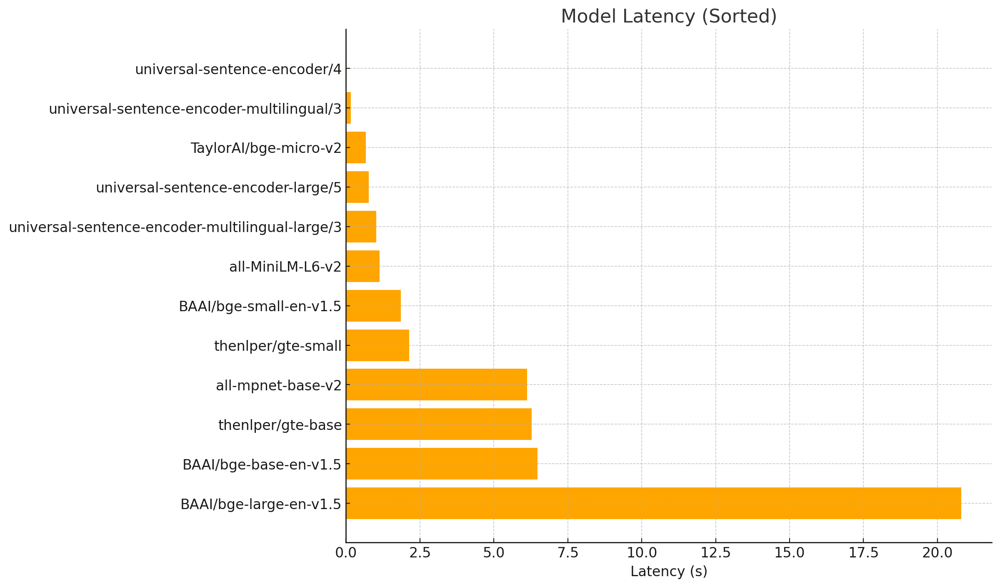
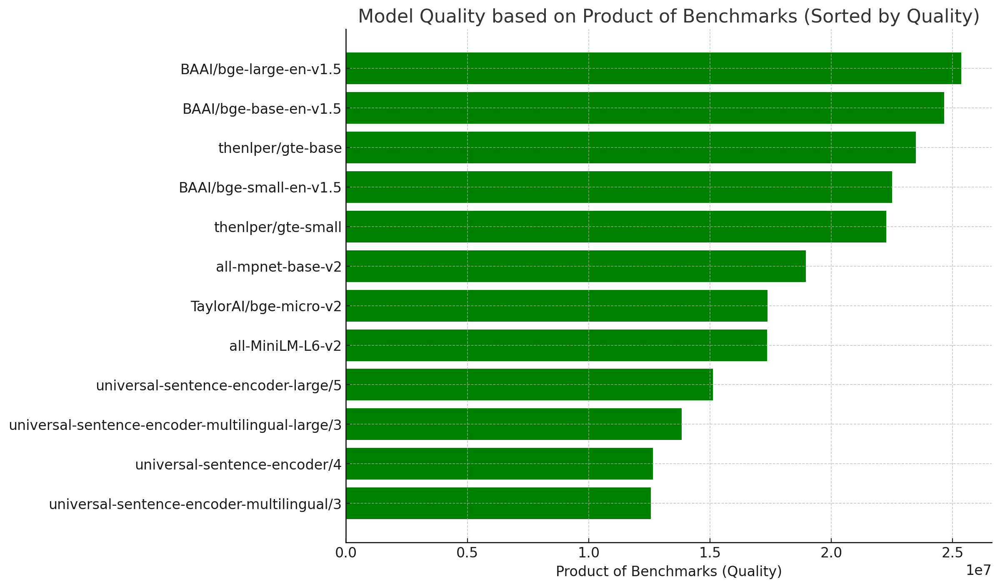
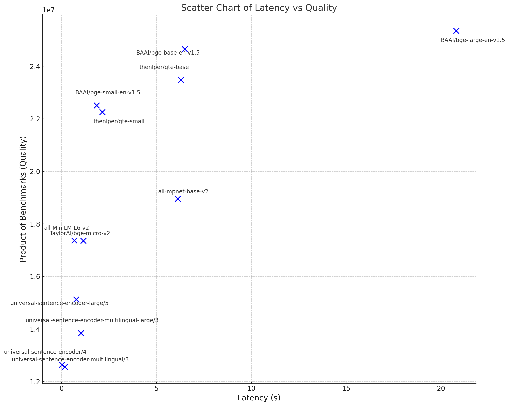
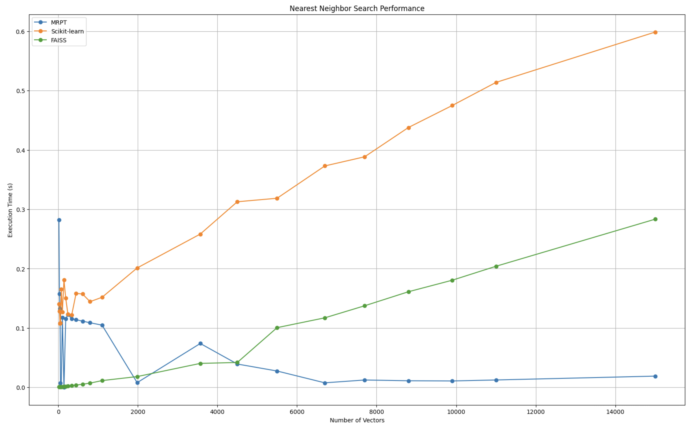

# VectorDB

[](https://discord.gg/aDNg6E9szy) [](https://twitter.com/KagiHQ) [](https://opensource.org/license/mit/) 

VectorDB is a lightweight, fully local, end-to-end solution for using embeddings embeddings for storing and retrieving text content. 

Thanks to its low latency and small memory footprint, VectorDB is used to power AI features inside [Kagi search](https://kagi.com).

## Installation

To install VectorDB, use pip:

```
pip install vectordb2
```

## Usage

Quick example that loads data into memory, and runs retrieval. All data will be handled locally, including embeddings and vector search, completely trasparent for the user with maximum possible performance. 

```
from vectordb import Memory

memory = Memory()

# memory.save(texts, metadata, memory_file)
memory.save("Hello world")


# You can also save content as a list with associated metadata as dict
memory.save(
    ["apples", "oranges"],
    [{"url": "https://apples.com"}, {"url": "https://oranges.com"}],
)

# Search for top n relevant chunks
# We will automatically use the fastest vector search backend
query = "hello"
results = memory.search(query, top_n=1)
print(results)
```

This returns the chunks with the added metadata and the vector distance (where 0 is the exact match and higher means further apart)

```
[
  {
    "chunk": "Hello world",
    "metadata": {},
    "distance": 0.87
  }
]

```

## Options


**Memory(memory_file=None, chunking_strategy={"mode":"sliding_window"},
embeddings="normal")**


- `memory_file`: *Optional.* Path to the memory file. If provided, memory will persist to disk and loaded/saved to this file. 
- `chunking_strategy`: *Optional.* Dictionary containing the chunking mode.
  
   Options:\
  `{'mode':'sliding_window', 'window_size': 240, 'overlap': 8}`   (default)\
  `{'mode':'paragraph'}`
- `embeddings`: *Optional.* 
  
   Options:\
   `fast` - Uses Universal Sentence Encoder 4\
   `normal` - Uses "BAAI/bge-small-en-v1.5" (default)\
   `best` - Uses "BAAI/bge-base-en-v1.5"\
   `multilingual` - Uses Universal Sentence Encoder Multilingual Large 3


   You can also specify a custom HuggingFace model by name eg. `TaylorAI/bge-micro-v2`. See also [Pretrained models](https://www.sbert.net/docs/pretrained_models.html) and [MTEB](https://huggingface.co/spaces/mteb/leaderboard).

**Memory.save(texts, metadata, memory_file=None)**

Save content to memory. Metadata will be automatically optimized to use less resources.

- `texts`: *Required.*  Text or list of texts to be saved.
- `metdata`: *Optional.* Metadata or list of metadata associated with the texts.
- `memory_file`: *Optional.* Path to persist the memory file. By default 

**Memory.search(query, top_n=5, unique=False)**

Search inside memory.

- `query`: *Required.* Query text.
- `top_n`:  *Optional.* Number of most similar chunks to return (default: 5).
- `unique`:  *Optional.* Return only items chunks from unique original texts (additional chunks coming from the same text will be ignored). Note this may return less chhunks than requested (default: False).

**Memory.clear()**

Clears the memory.


**Memory.dump()**

Prints the contents of the memory.


## Example

```
from vectordb import Memory

memory = Memory(
    chunking_strategy={"mode": "sliding_window", "window_size": 128, "overlap": 16}, embeddings='TaylorAI/bge-micro-v2'
)

texts = [
    """
Machine learning is a method of data analysis that automates analytical model building.

It is a branch of artificial intelligence based on the idea that systems can learn from data,
identify patterns and make decisions with minimal human intervention.

Machine learning algorithms are trained on data sets that contain examples of the desired output. For example, a machine learning algorithm that is used to classify images might be trained on a data set that contains images of cats and dogs.
Once an algorithm is trained, it can be used to make predictions on new data. For example, the machine learning algorithm that is used to classify images could be used to predict whether a new image contains a cat or a dog.

Machine learning algorithms can be used to solve a wide variety of problems. Some common applications of machine learning include:

Classification: Categorizing data into different groups. For example, a machine learning algorithm could be used to classify emails as spam or not spam.

Regression: Predicting a continuous value. For example, a machine learning algorithm could be used to predict the price of a house.

Clustering: Finding groups of similar data points. For example, a machine learning algorithm could be used to find groups of customers with similar buying habits.

Anomaly detection: Finding data points that are different from the rest of the data. For example, a machine learning algorithm could be used to find fraudulent credit card transactions.

Machine learning is a powerful tool that can be used to solve a wide variety of problems. As the amount of data available continues to grow, machine learning is likely to become even more important in the future.
""",
    """
Artificial intelligence (AI) is the simulation of human intelligence in machines
that are programmed to think like humans and mimic their actions.

The term may also be applied to any machine that exhibits traits associated with
a human mind such as learning and problem-solving.

AI research has been highly successful in developing effective techniques for solving a wide range of problems, from game playing to medical diagnosis.

However, there is still a long way to go before AI can truly match the intelligence of humans. One of the main challenges is that human intelligence is incredibly complex and poorly understood.

Despite the challenges, AI is a rapidly growing field with the potential to revolutionize many aspects of our lives. Some of the potential benefits of AI include:

Increased productivity: AI can be used to automate tasks that are currently performed by humans, freeing up our time for more creative and fulfilling activities.

Improved decision-making: AI can be used to make more informed decisions, based on a wider range of data than humans can typically access.

Enhanced creativity: AI can be used to generate new ideas and solutions, beyond what humans can imagine on their own.
Of course, there are also potential risks associated with AI, such as:

Job displacement: As AI becomes more capable, it is possible that it will displace some human workers.

Weaponization: AI could be used to develop new weapons that are more powerful and destructive than anything we have today.

Loss of control: If AI becomes too powerful, we may lose control over it, with potentially disastrous consequences.

It is important to weigh the potential benefits and risks of AI carefully as we continue to develop this technology. With careful planning and oversight, AI has the potential to make the world a better place. However, if we are not careful, it could also lead to serious problems.
""",
]

metadata_list = [
    {
        "title": "Introduction to Machine Learning",
        "url": "https://example.com/introduction-to-machine-learning",
    },
    {
        "title": "Introduction to Artificial Intelligence",
        "url": "https://example.com/introduction-to-artificial-intelligence",
    },
]

memory.save(texts, metadata_list)

query = "What is the relationship between AI and machine learning?"
results = memory.search(query, top_n=3, unique=True)
print(results)

# two results will be returned as unique param is set to True
```

Output:
```
[
  {
    "chunk": "Artificial intelligence (AI) is the simulation of human intelligence in machines that are programmed to think like humans and mimic their actions. The term may also be applied to any machine that exhibits traits associated with a human mind such as learning and problem-solving. AI research has been highly successful in developing effective techniques for solving a wide range of problems, from game playing to medical diagnosis. However, there is still a long way to go before AI can truly match the intelligence of humans. One of the main challenges is that human intelligence is incredibly complex and poorly understood. Despite the challenges, AI is a rapidly growing field with the potential to revolutionize many aspects of our lives. Some of the potential benefits of AI include: Increased",
    "metadata": {
      "title": "Introduction to Artificial Intelligence",
      "url": "https://example.com/introduction-to-artificial-intelligence"
    },
    "distance": 0.87
  },
  {
    "chunk": "Machine learning is a method of data analysis that automates analytical model building. It is a branch of artificial intelligence based on the idea that systems can learn from data, identify patterns and make decisions with minimal human intervention. Machine learning algorithms are trained on data sets that contain examples of the desired output. For example, a machine learning algorithm that is used to classify images might be trained on a data set that contains images of cats and dogs. Once an algorithm is trained, it can be used to make predictions on new data. For example, the machine learning algorithm that is used to classify images could be used to predict whether a new image contains a cat or a dog. Machine learning algorithms can be used",
    "metadata": {
      "title": "Introduction to Machine Learning",
      "url": "https://example.com/introduction-to-machine-learning"
    },
    "distance": 0.83
  }
]

```

## Embeddings performance analysis


We constantly evaluate embedding models using standardized benchmarks (higher is better). Average latency is measured locally on CPU (lower is better). Benchmark data pulled from [MTEB](https://huggingface.co/spaces/mteb/leaderboard). 


| Model                                         | Latency  | Benchmark 1 | Benchmark 2 | Benchmark 3 | Benchmark 4 |
|-----------------------------------------------|----------|-------------|-------------|-------------|-------------|
| all-mpnet-base-v2                              | 6.12 s   | 80.28       | 65.07       | 43.69       | 83.04       |
| all-MiniLM-L6-v2                               | 1.14 s   | 78.9        | 63.05       | 42.35       | 82.37       |
| BAAI/bge-large-en-v1.5                         | 20.8 s   | 83.11       | 75.97       | 46.08       | 87.12       |
| BAAI/bge-base-en-v1.5                          | 6.48 s   | 82.4        | 75.53       | 45.77       | 86.55       |
| BAAI/bge-small-en-v1.5                         | 1.85 s   | 81.59       | 74.14       | 43.82       | 84.92       |
| TaylorAI/bge-micro-v2                          | 0.671 s  | 78.65       | 68.04       | 39.18       | 82.81       |
| TaylorAI/gte-tiny                              | 1.25 s   | 80.46       | 70.35       | 42.09       | 82.83       |
| thenlper/gte-base                              | 6.28 s   | 82.3        | 73.01       | 46.2        | 84.57       |
| thenlper/gte-small                             | 2.14 s   | 82.07       | 72.31       | 44.89       | 83.54       |
| universal-sentence-encoder-large/5             | 0.769 s  | 74.05       | 67.9        | 37.82       | 79.53       |
| universal-sentence-encoder-multilingual-large/3| 1.02 s   | 75.35       | 65.78       | 35.06       | 79.62       |
| universal-sentence-encoder-multilingual/3      | 0.162 s  | 75.39       | 63.42       | 34.82       | 75.43       |
| universal-sentence-encoder/4                   | 0.019 s  | 72.04       | 64.45       | 35.71       | 76.23       |








## Vector search performance analysis

VectorDB is also optimized for speed of retrieval. We automatically uses [Faiss](https://github.com/facebookresearch/faiss) for low number of chunks (<4000) and [mrpt](https://github.com/vioshyvo/mrpt) for high number of chunks to ensure maximum performance across the spectrum of use cases.



## License

MIT License.
